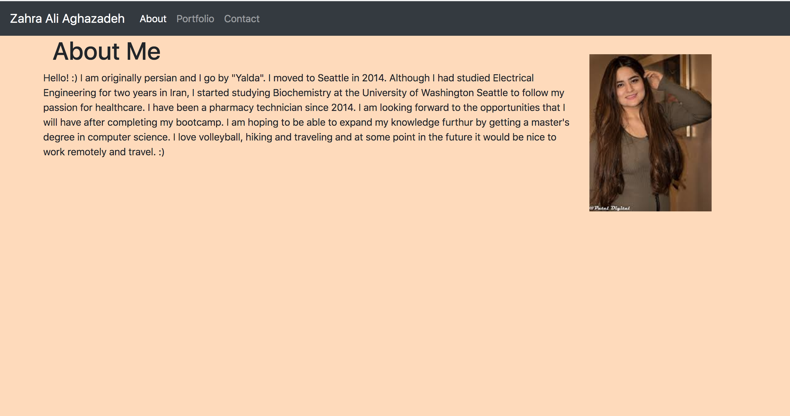
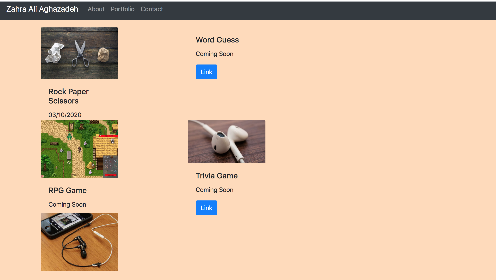
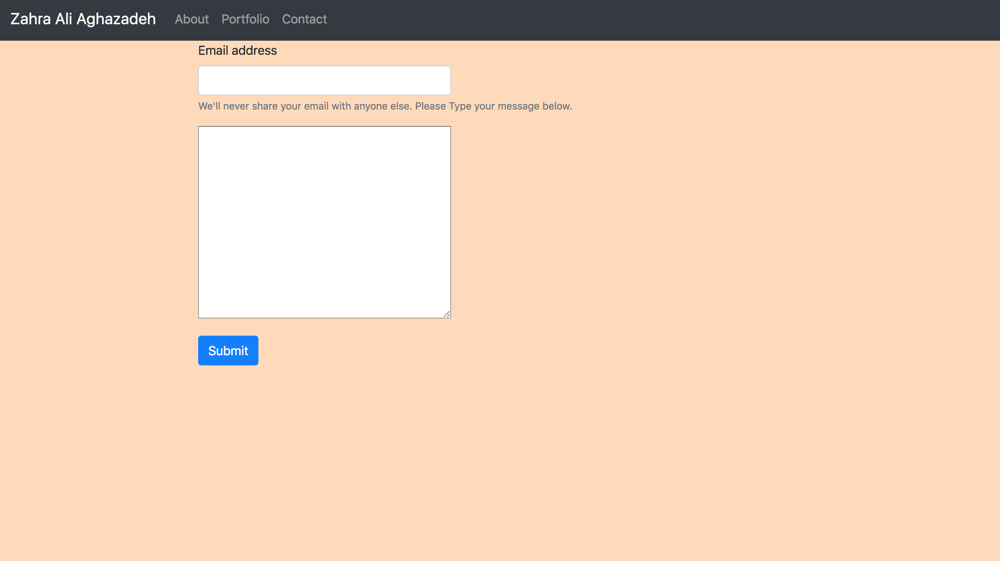
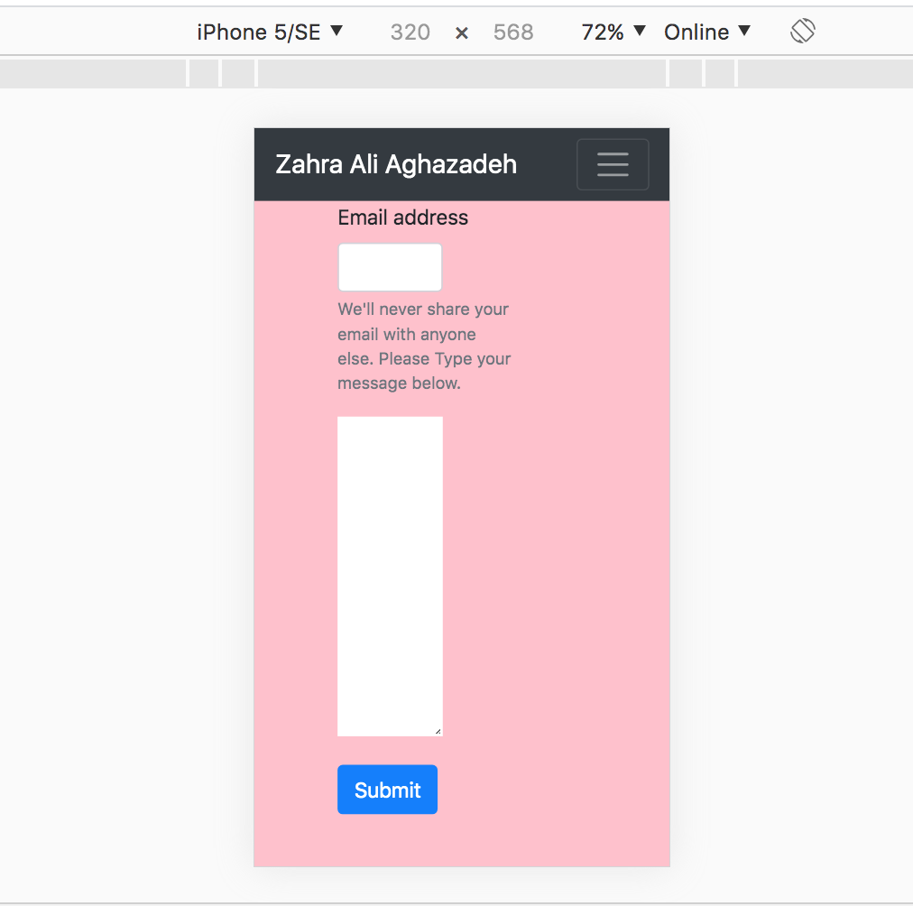

# Project Name
> Here goes your awesome project description!

## Table of contents
* [General-info](#General-info)
* [Screenshots](#screenshots)
* [Technologies](#technologies)
* [Setup](#setup)
* [Features](#features)
* [Status](#status)
* [Inspiration](#inspiration)
* [Contact](#contact)

## General-info:
a)Progress
1) Created four initial files for html , CSS, JS and Readme , and then two additional html files for portfolio and contact.
2) linked the css and JS files to the main index.html. and repeat on contact.html and portfolio.html.
3) Used bootstrap for Navbar and modified it accordingly with wanted tabs such as about, portfolio and contact. Using bootstrap made it easier compared to using CSS on each and every details.
4) Applied the Navbar on contact and portfolio html as well. So that they will all have the same look on top navigation bar.
5) In the body, I tried to use Container and Div , to give a specified amount of space to each Div containing text and image. I assigned them as 9 and 3 in the row, as two columns.
6) using some pseudocodes to direct myself.
7) used image fluid and image thumbnail so that it will adjust the photo size by decreasing screen size.
8) wrote a paragraph about me in about tab.
9) In contacts , changed input to textarea so that the space will be larger to type a message.
10) one problem was that the two parts in contacts were not aligned , I took out the label contact and they look better now, but I need to adjust that so Message label will show above the text area.
11) In portfolio I made three rows and 2 columns, they are overlapping for some reason. 
12)added media on the css file to adjust some changes with screensize change.
13)css file was quite alot of trying and erasing commands to see the changes, it can be adjusted more.

b) What did you learn? 
I definitely got more comfortable with using bootstrap, using grid system, adjusting the codes that I copy paste from bootstrap.

c) What makes your project stand out? 
This project is made from scratch and every piece is taken from class lectures. It has been a good attempt to pay attention to details such as portfolio having _blank so that the links will open in a new tab. 

## Screenshots

## Technologies
* Bootstrap for style: [Bootstrap](https://www.trilogyed.com/)

## Setup
To view this portfolio you can click : [here](https://zahraaliaghazadeh.github.io/Portfolio/)

## Features
* feature 1: This code has the responsive ability, it can customize its sizes depending on changes to the screen.
* feature 2: responsive tabs to open once clicked for portfolio and contact me.

To-do list:
* improvement to be done 1: make the looks of it better by finding better colors and alignment of photos and texts.
* improvement to be done 2: has to improve in terms of adjusting the screen size.

## Status
Portfolio is: _in progress_, as there will be more projects in the course to be added.

## Inspiration
A start to having an outstanding portfolio has been the inspiration.

## Contact
Email: zahraaliaghazadeh@gmail.com

LinkedIn: [LinkedIn](https://www.linkedin.com/in/yalda-aghazade-7a9b0390)

feel free to contact me!
